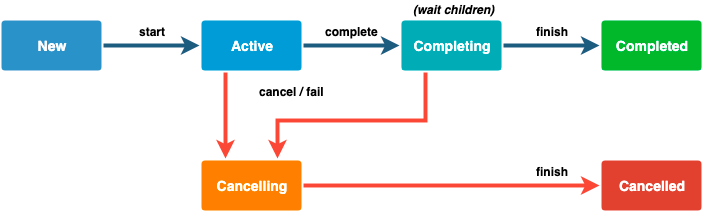
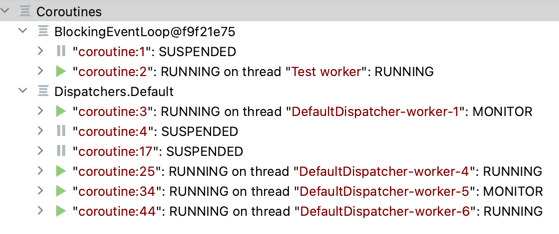

# Kotlin

## Coroutine

### 비동기 함수
* 비동기 함수는 두가지 종류가 있다.
1. Job
  * 결과 없음. 결과를 대기하지 않는다. fire and forget
  * `launch`로 생성한다
  * `join`을 사용하면 결과를 기다린다
2. Deferred
  * 결과 반환함
  * Future, Promise의 구현체
  * `async`로 생성
  * `launch`, `async`에 `start=CoroutineStart.LAZY` 옵션을 주면 lazy하게 시작할 수 있다

### Job Life cycle



|  State |  isActive |  isCompleted |  isCancelled |
|---|---|---|---|
|  New (optional initial state) |  false |  false |  false |
|  Active (default initial state) |  true |  false |  false |
|  Completing (transient state) |  true |  false |  false |
|  Cancelling (transient state) |  false |  false |  true |
|  Cancelled (final state) |  false |  true |  true |
|  Completed (final state) |  false |  true |  false |

  * 상태는 한 방향으로만 이동한다. 최종 상태는 Cancelled, Completed다. 완료되면 재시작 할 수 없다.

### 코루틴 디버깅
* `-Dkotlinx.coroutines.debug` JVM 옵션으로 코루틴을 식별할 수 있다
    ```
    Start : main @coroutine#1
    First 0: firstPool-1 @coroutine#2
    Second 0: secondPool @coroutine#3
    First 1: firstPool-2 @coroutine#4
    End: main @coroutine#1
    ```
* `CoroutineName()` 으로 특정 이름을 지정할 수 있다.
    ```
    CoroutineScope(pool + CoroutineName("myname")).async() {
        ... // First 0: firstPool-3 @myname#8
    }
    ```
* coroutine stacktraces를 확인할 수 있다
`testImplementation("org.jetbrains.kotlinx:kotlinx-coroutines-debug:1.6.4")`
    ```kt
    DebugProbes.install()
    val deferred = async { computeValue() }
    delay(1000)
    DebugProbes.dumpCoroutines()
    DebugProbes.printJob(deferred)
    ```
    stack trace
    ```
    Coroutine "coroutine#2":DeferredCoroutine{Active}@e133552c, state: SUSPENDED
        at quick.start.CoroutineDebuggingTest.combineResults(CoroutineDebuggingTest.kt:16)
    ```
* IntelliJ의 Debug tool
  
